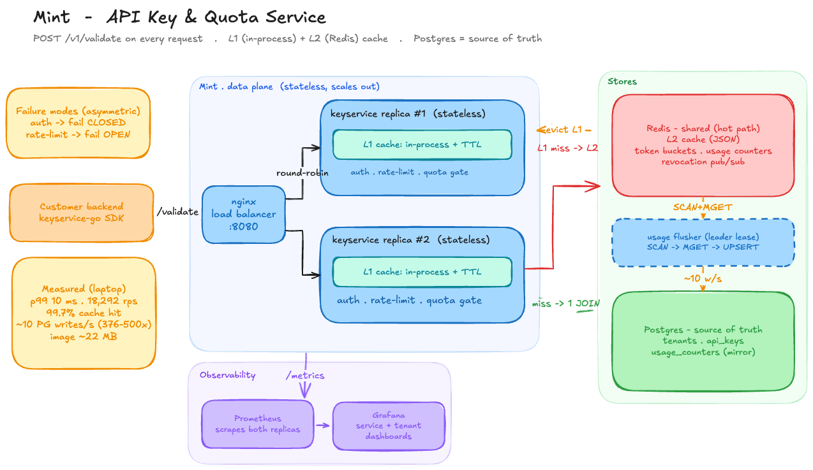
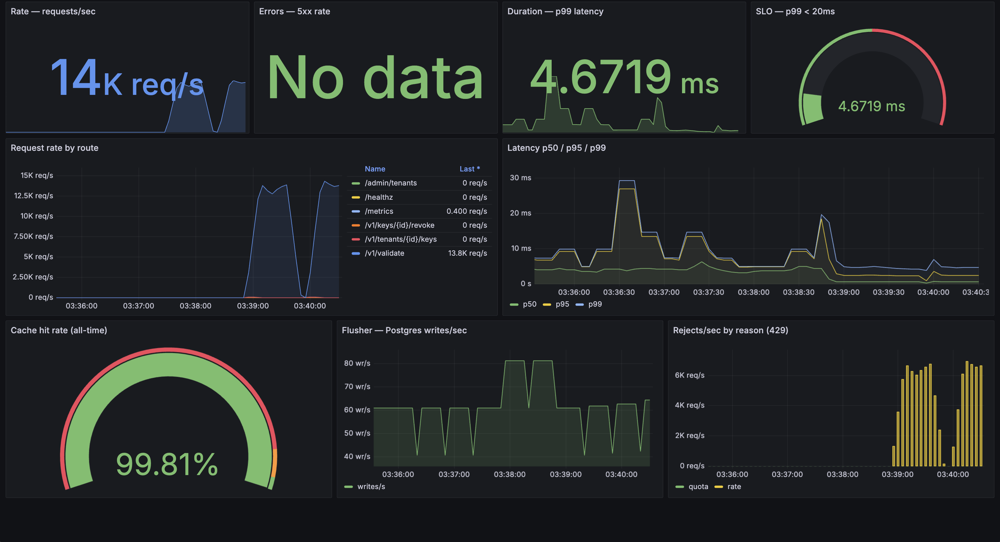

# Mint — API Key & Quota Service

> Issue, validate, rate-limit, and meter API keys for your other backends. Every incoming request triggers one `POST /v1/validate` — a single Redis round-trip on a cache hit, with Postgres kept off the hot path entirely.




## What is Mint?

Every backend re-implements the same boring, security-critical plumbing: check the API key, enforce a rate limit, track usage against a quota. **Mint centralizes that into one fast service.** Your backends call `POST /v1/validate` on every request, and Mint answers *allowed / invalid / rate-limited / over-quota* in a single Redis round-trip on a cache hit — Postgres, the source of truth, never sits on the hot path.

It's a **stateless Go service behind nginx**, scaled horizontally across replicas, with an asymmetric failure mode by design: **auth fails closed** (any doubt → reject; security first) while **rate-limiting fails open** (Redis down → allow; availability first).

The performance comes from three ideas, all visible in the diagram above:

- **A three-tier read path** — in-process **L1** (per replica) → shared Redis **L2** → Postgres. A revoke is broadcast over Redis pub/sub so every replica evicts its L1 within milliseconds.
- **One atomic Lua gate** — rate-limit + monthly-quota check + usage `INCR` ride a *single* Redis round-trip.
- **Write coalescing** — usage lives as a Redis counter; a background flusher batches it to Postgres, collapsing thousands of metering writes/sec into ~10/sec.

**→ [Full system design](https://docs-navy-tau.vercel.app/mint-system-design.html)** — architecture, the `/validate` pipeline stage-by-stage, every component with the real code, and the measured numbers.

## Integrate in one line

Your backend `go get`s the stdlib-only SDK and wraps its router. That's the entire integration — there is no per-handler auth, rate-limit, or quota code:

```go
import keysvc "github.com/Sashreek007/mint/keyservice-go"

client := keysvc.New("http://mint:8080")
http.ListenAndServe(":9000", client.Middleware(mux)) // every route above is now gated
```

Inside any handler the authenticated tenant is already in the request context:

```go
tenant, _ := keysvc.TenantID(r.Context())
```

A transport failure (Mint unreachable) returns **`503` fail-closed** by default; opt into `WithFailOpen()` to trade strictness for availability — an explicit consumer choice.

## Results

Measured on a MacBook Pro (Apple M2 Pro, 10 cores / 16 GB) with the load generator running on the **same machine** as the full stack — so absolute numbers are a floor, and the before/after deltas are the reliable signal. Every figure is reproducible from a committed script in [`benchmarks/`](benchmarks/RESULTS.md).

| Metric | Baseline | Cached | Result |
|---|---|---|---|
| `/validate` throughput (`hey -c 50`) | 12,018 rps | **18,292 rps** | **+52%** |
| p99 latency | 17 ms | **10 ms** | **−41%** (SLO < 20 ms ✓) |
| p50 latency | 3.2 ms | 2.2 ms | −31% |
| Cache hit rate (realistic, cold start) | — | **99.7%** | @ 1k keys |
| Metering writes to Postgres | ~5,000/s | **~10/s** | **376–500×** reduction |
| Container image | — | **~22 MB** | multi-stage |

Live under a realistic sine-wave load — the service-health dashboard (RED metrics, p99, cache hit-rate, flusher write-rate, 429 rejects by reason):



**→ [Full benchmark methodology & numbers](benchmarks/RESULTS.md)**

## Quick start

Requires Docker. This brings up nginx + 2 keyservice replicas + Postgres + Redis + Prometheus + Grafana + the demo product:

```bash
docker compose up -d --build
```

### Try the demo — watch Mint enforce

Provision a tenant + key, then hammer the demo product (a stock-price API gated by Mint) and watch `200`s turn into `429`s as the rate limit bites:

```bash
# provision a tenant + API key (plaintext key is shown once)
TID=$(curl -s -XPOST localhost:8080/admin/tenants \
  -H 'X-Admin-Token: just-works-for-now' -H 'content-type: application/json' \
  -d '{"name":"demo-co"}' | jq -r .id)
KEY=$(curl -s -XPOST localhost:8080/v1/tenants/$TID/keys \
  -H 'X-Admin-Token: just-works-for-now' -H 'content-type: application/json' \
  -d '{"name":"laptop"}' | jq -r .key)

# burst it: a few hundred allowed (the bucket), the rest rate-limited
cd demo && go run ./cmd/burst -key "$KEY" -n 2000 -c 50
#  allowed=327  rate_limited=1673  quota_exceeded=0  invalid=0
#  2000 requests in 1.6s = 1250 req/s
```

A tenant created with `"monthly_quota": 50` instead caps `allowed` at ~50 and then returns `429 monthly quota exceeded`. Open **Grafana at http://localhost:3000** (no login) to watch the rps wave, p99, and rejects-by-reason live.

### Run the end-to-end tests

The verdict matrix — valid → `200`, missing/garbage/revoked → `401`, over-rate / over-quota → `429`, Mint unreachable → `503` — runs two ways behind one seam:

```bash
go -C integration test -tags live ./...   # against the running stack (fast)
go -C integration test ./...              # hermetic — testcontainers spins its own stack
```

### Reproduce the benchmarks

Four load tools, each isolating one thing (full cold-start procedure in [`RESULTS.md`](benchmarks/RESULTS.md)):

```bash
# peak throughput + latency, before/after the cache   (hey, one warm key)
./benchmarks/run.sh

# realistic throughput + cache hit rate   (Go loadgen — many keys, Zipf, 5% invalid)
cd benchmarks/loadgen && go run . -keys 1000 -requests 300000 -concurrency 50

# usage-metering write reduction, Target #3   (Go loadgen + psql)
./benchmarks/write_reduction.sh

# fill the Grafana dashboard with lifelike sine-wave traffic   (the screenshot above)
cd benchmarks/realistic_load && go run . -duration 2m
```

## Repo layout

| Module | What it is |
|---|---|
| [`keyservice/`](keyservice/) | the server — `internal/` split into **keys** (crypto), **store** (SQL + pgxpool), **cache** (L1 + L2 + pub/sub), **ratelimit** (Lua gate), **usage** (flusher), **api** (HTTP) |
| [`keyservice-go/`](keyservice-go/) | the stdlib-only client SDK + one-line middleware — what your backends import |
| [`demo/`](demo/) | an example consumer (stock-price API) gated by Mint, plus `cmd/burst` (the load driver) |
| [`integration/`](integration/) | end-to-end verdict-matrix tests (testcontainers + `-tags live`) |
| [`benchmarks/`](benchmarks/) | reproducible load scripts + [`RESULTS.md`](benchmarks/RESULTS.md) |
| [`infra/`](infra/) · [`docs/`](docs/) | nginx · Prometheus · Grafana provisioning · the design docs |

## API

| Endpoint | Auth | Purpose |
|---|---|---|
| `POST /v1/validate` | `Bearer <key>` | the hot path — `200` / `401` / `429` |
| `POST /admin/tenants` | `X-Admin-Token` | create a tenant (optional `monthly_quota`) |
| `POST /v1/tenants/{id}/keys` | `X-Admin-Token` | issue a key (plaintext shown once) |
| `POST /v1/keys/{id}/revoke` | `X-Admin-Token` | revoke — invalidated fleet-wide via pub/sub |
| `GET /v1/tenants/{id}/usage` | `X-Admin-Token` | live usage vs quota |
| `GET /metrics` · `/healthz` · `/readyz` | — | Prometheus · liveness · readiness (pings PG + Redis) |

## Stack & docs

**Stack:** Go 1.25 (stdlib-first; `pgx/v5`) · Postgres 16 · Redis 7 · nginx · Docker Compose · Prometheus + Grafana.

**Docs (live):**
[System design](https://docs-navy-tau.vercel.app/mint-system-design.html) · [Build log & glossary](https://docs-navy-tau.vercel.app/design.html) · [Demo walkthrough](https://docs-navy-tau.vercel.app/demo.html) · [Benchmark results](benchmarks/RESULTS.md).
